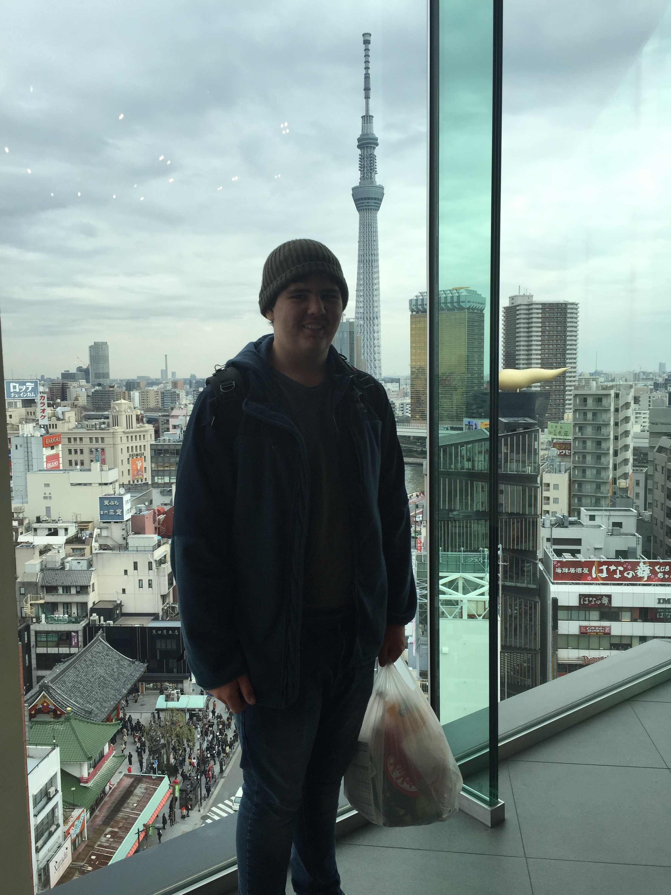
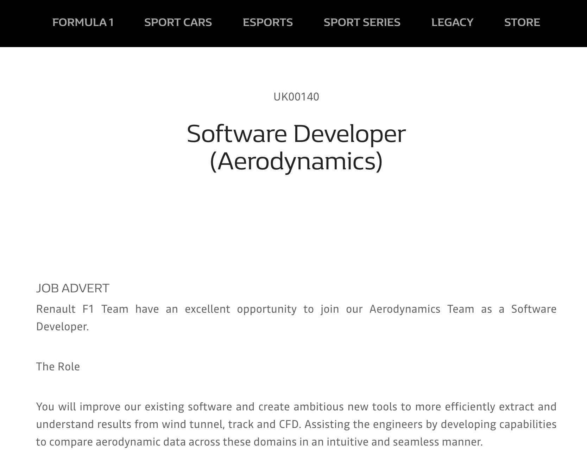

# Adam Matthews
                                                                              
- S3853376
- S3853376@student.rmit.edu.au

I am a full time student from Townsville, North Queensland who has moved to Brisbane for greater opportunities in the field of Information Technology, more specifically- Software Development.  While I love all to do with computers, in my free time you will find me fishing, listening to music or intently following world sport, from Australian Rules Football to Formula 1 racing.  A long term goal of mine is to one day be able to merge these pastimes with my fascination for software development in a professional setting.

## IT In My Life

My interest in the IT field is to be able contribute to technology in the fishing world, or be a part of a sports team or organisation that I have grown up loving.  My fascination for software development sparked early in primary school when it was announced that there would be testing for North Queensland's first ever 'laptop class' in primary education.  Having passed the test and been admitted into the class I was able to see in just two years how accessible and connected the world was becoming.  Learning to create my first programs, and countless simple games afterwards, was where my interest truly flourished into fascination.  

I chose to study at RMIT in an effort to gain global recognition upon the completion of my degree.  I also see RMIT as a university that grants flexibility and a customisable experience when it comes to subjects and courses.  This gives me great opportunities to hone the exact set of skills that I would like to pursue in a professional setting. 

Throughout my studies I expect to learn. Firstly, how to further my practical skills in programming to a very professional and competitive standard.  This includes not only the skills to fix and maintain programs, but the more creative, more innovative side of software development also.  Secondly, I am expecting to learn how to implement my abilities properly in the workplace.  This includes learning how to work as a team, and the ability to build close working relationships with peers.  

## My Ideal Job

An example of my ideal job in IT would be a software developer in the research and development field for and organisation such as Renault Sport Racing.  This particular advertisement demands a candidate that can make results from varying modes of testing available to engineers in an organised and streamlined approach.  Ultimately, this position would give me the opportunity to play a significant role in developing the car.  Having the ability to contribute to a potential Formula 1 World Championship is what makes this position truly appealing to me.  

[RSR - Software Developer](https://www.renaultsport.com/-careers-365-?id_job=870)

  

The skills that are required for the position include; exceptional proficiency in Python and JavaScript programming languages, as well as the ability to use a number of programs for building user interfaces.  It is also a requirement of the candidate to be able to accommodate the real-time communication of data through libraries such as Socket.IO.  No essential qualifications have been identified by the team.  However, the applicant must have several years of experience in writing applications in a professional environment and a thorough knowledge of web databases.  

I currently do not possess any experience practicing software development professionally, nor do I possess any valid qualifications yet.  Further, my skills in the appropriate coding languages and in online database services are very minimal.  Any skills I have gained in this area have only come from nearly one month of study and casual experimentation in my own time.

To obtain these skills I must, as a minimum, be an active participant in every area of my studies.  Including not only the technical aspects, but also participating in the parts that will teach me to excel in a professional team oriented environment.  To make this position truly realistic to me however, I will have to practice my proficiency in creating my own projects outside of just the university, as well as keep up to date with all the relevant languages and systems as the IT field continues to grow and expand.  Even though this particular position doesn't require any specific qualifications, it is likely that similar jobs in the future will.  This will drive me to gain as much accreditations as I can, starting with a university degree.  Further, gaining as many possible qualifications will only hold me in good stead for any future prospects.  Lastly, I will gain the experience needed over years of relevant professional work.  This will start at entry level and include simple tasks such as maintaining, testing and debugging; and will grow into more complex projects("What Does an Entry Level… 2020").  This technical experience will also be complimented by my growing confidence in a professional, team environment as a result. 

## My Personal Profile 

- Myers-Briggs Test: ISTP

- Big Five Personality Test: High scores in - Agreeableness & Conscientiousness

- Learning Style Test : Visual Learner 

My result in the Myers- Briggs Personality Test indicates that I am accepting, adaptable and am adept at finding workable solutions-valuing efficiency ("The 16 MBTI Types. 2020").  It also indicates that I will have a tendency to value facts over concepts.  The MBTI results are further supported by the results from the Big Five Personality Test where I scored highly in agreeableness.  I also scored highly in conscientiousness.  This suggests that I am diligent worker (""Big Five Personality Test. 2019") who values organisation.  According to the Learning Style Test I am a visual learner; implying that I remember things by sight or example, rather than spoken instructions ("What's Your Learning Style. 2019").      

These results suggest that I am more likely to be very accepting of people's ideas and proposals within a team.  At the same time, I will value those with clear instructions rather than vague concepts.  The fact that I am diligent worker and introverted may mean that my communication within a team will be lacking.  Moreover, my knowledge of my weaknesses attained from these various tests will let me monitor my behaviour and allow me to aim to be more well-rounded as a team member. 

I should take these results into account when forming a team by seeking out others that compliment both my personality and learning style.  My ideal team would include strong leaders who are natural instigators in conversation, to ensure clarity throughout the group.  Further, I would preferably seek out those who share the same traits of being organised and diligent workers.  This would assist in avoiding conflict within the group. 

## Project Idea

## Refrences 

